# Plant, Water, Fire! 
Project 2 - Brogan Carpenter

[View Live Project](https://brogandaisy.github.io/Plant-Water-Fire/)

# Plant, Water, Fire!

This project is a game based on the Rock, Paper, Scissors format. It allows the user to play the game and compete with the computer. They can keep track of their score, and aim to hit a score of 10 ahead of the computer to win the game! 

## About Plant, Water, Fire!

Plant, Water, Fire! is a modern twist on the classic Rock-Paper-Scissors game, designed to appeal to a broader audience with a focus on female players and older gamers. With soft, inviting colors and simple rules, it’s perfect for young children to play with their parents or for adults to enjoy solo. The scoring system keeps players engaged until they reach 10 points, encouraging them to play longer and strive for better scores each time.
## Table of Contents

1. [UX](#user-experience-ux)
    - [User Stories](#user-stories)
2. [Design](#design)
    - [Wireframes](#wireframes)
3. [Deployment](#deployment)
4. [Features](#features)
5. [Testing](#testing)
    - [Browser Testing](#browser-testing)
    - [Code Validation](#code-validation)
    - [Lighthouse Test](#lighthouse-testing)
6. [Technologies Used](#technologies-used)
7. [Credits and Reference](#credits-and-reference)

## User Experience UX

### User Stories
The game wanted to demonstrate different elements to keep the players engaged for longer. This was incorporated by having a score system which see's the player and computer competing to get to 10 before the other - resulting in a win! Another aim for the game, was to have an easy and clear experience for the user. This was demonstrated by having an easy to follow instructions button to click, which opened a dialogue pop-up for the user to be free from any game distractions and allow uninterupted focus to read the rules.

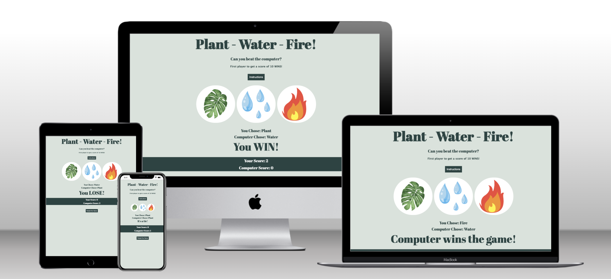

## Design
The games design has been chosen to be simple, yet match the games theme. Different tones of green demonstrate the nature element to the game, and the large icon's make it easy to understand. The game has been designed for mobile and for desktop, allowing players to mix between the two and have the same game experience. When designing the wireframes, the priority was to have all the game elements on one page. This way the player can see their choice in icon, their score, and if they won the game or round. Having the instructions for the game seperate, in a pop-up dialogue box, allowed returning players to get straight into the game without the need to scroll past rules. The rules button had been placed at the top of the page, allowing new players to find the rules of the game easily, compared to some games having the rules at the bottom of the page.

### Brand Colours
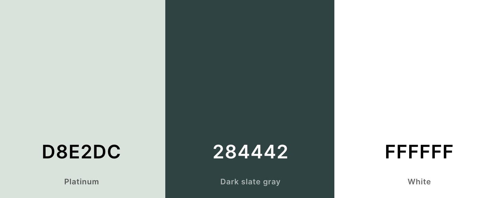

## Wireframes

### Desktop Wireframes
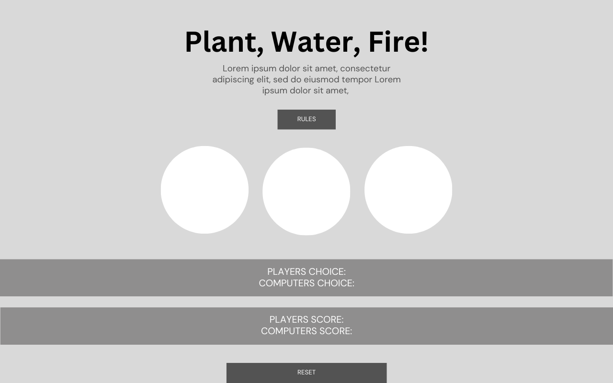
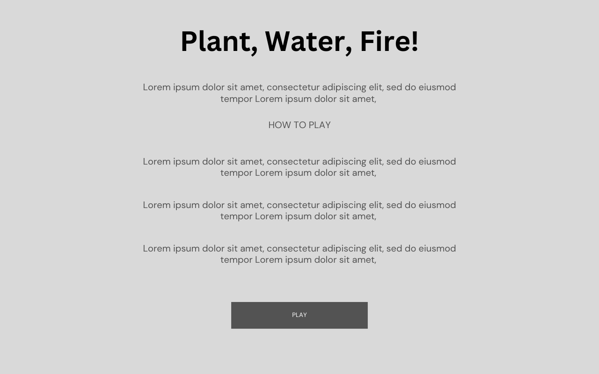

### Mobile Wireframes
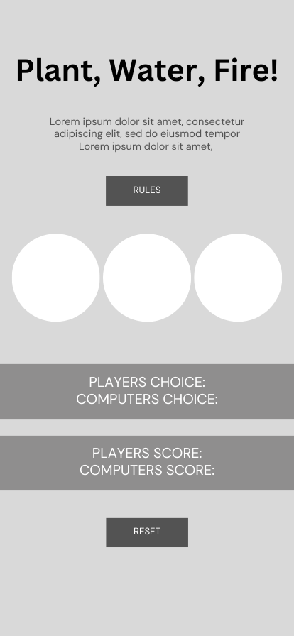
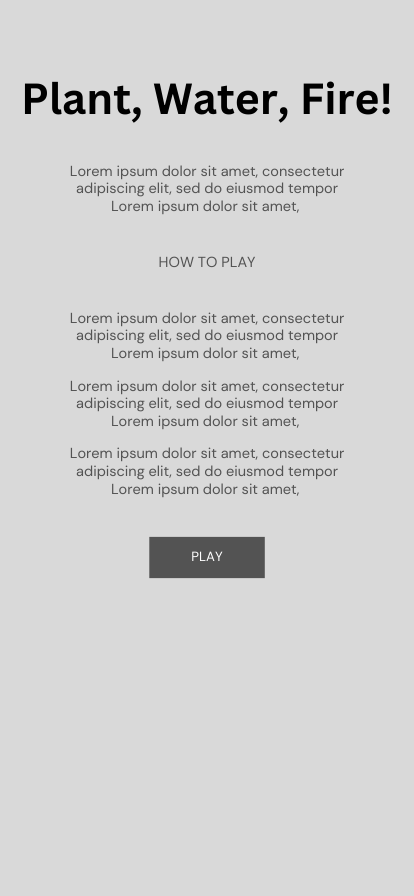

## Deployment
Using Github and Gitpod to deploy my project. 

### My Repository

1. Created a new public local repository on my Github account, and copied the repository to Gitpod to start building the website.

2. When writing my code using Gitpod, I ensured I committed my changes to my local repository in regular intervals, using clear messaging for any changes I had made. 
      - git add .
      - git commit -m "This would be my message on what I had changed"

3. After making my regular commits, I would then push the commits to my remote repository by using the command 'git push'. 

### Hosting 

1. To host my website, I went to Github and selected my repository named plant-water-fire.
2. I went to Settings > Pages 
3. I made sure the following settings were applied:
      - Source: 'Deploy from a branch' on the dropdown menu
      - Branch: 'Main' and 'root' from the dropdown menus
      - Pressed save
4. This takes a few minutes to deploy, and will be found on the righthand-side of the repository dashboard page. 

### Deployment on Github
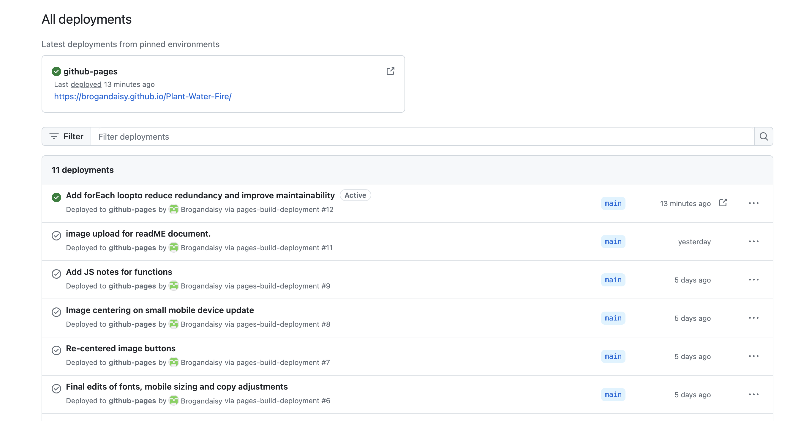

## Features
The features for this website were chosen for a simple user experience, allowing the game to be played easily by a wide age audience. 

### Instruction Pop-up
- The instructions were seperate to the homepage of the game as a dialogue pop-up, allowing an easy place for new players to learn the rules, and for returning players to get straight to the game. The instructions were simple, straight forward and explained the results of each round and icon.
  
- To go back to the game, you can either press the text 'Click to PLAY' or click anywhere on the page. This feature allowed easy access back to the game to play. No need to search for an 'X' icon, and the text allowed the player to know where to click if they didnt discover the click anywhere feature.

- I used the following code for the dialogue box to pop up and to exit:

btn.onclick = function() {
  
    modal.style.display = "block"
    }
    
span.onclick = function() {
        
    modal.style.display = "none";
    }
    
window.onclick = function(event) {
        
    if (event.target == modal) {
    modal.style.display = "none";
        }

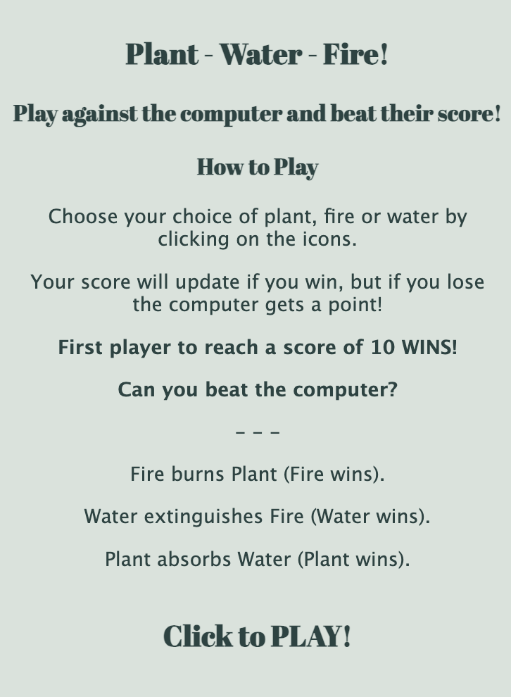
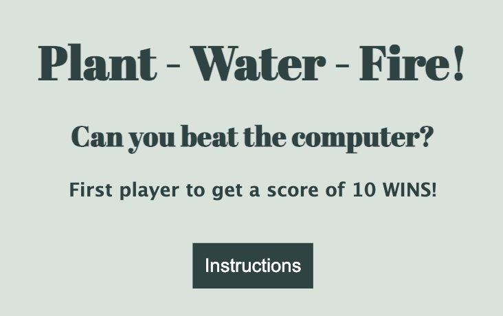

### Players Choice vs Computers Choice
- So that the player can play the game when they choose, and on their own, the 'computers choice' feature was added. When the player chooses their icon to play in the game, the computer chooses an icon at random simultaniously. This is selected at random using the following code:

function playGame(playersChoice) {

    const computersChoice = choices[Math.floor(Math.random() * 3)];
    let result = "";
- The game also displays what the player chose in that particular round, alongside what the computer chose. Once both players have chosen an icon, the result of the round will also be displayed. If the players choice and the computers choice equals the same, the round results in a tie, I then used else, and if statements to get the remaining round resukts. I used the following code:

if (playersChoice === computersChoice){

        result = "It's a tie!";
    }
    else {
        switch(playersChoice){
            case "Plant" : 
            result = (computersChoice === "Water") ? "You WIN!" : "You LOSE!";
            break;
            case "Fire" : 
            result = (computersChoice === "Plant") ? "You WIN!" : "You LOSE!";
            break;
            case "Water" : 
            result = (computersChoice === "Fire") ? "You WIN!" : "You LOSE!";
            break;
        }

### Update Scores
- So the player can keep track on their score, and keep playing to beat the computer, the feature to track the score was added. This tallied the score for both the computer and the player with this code:

playersDisplay.textContent = `You Chose: ${playersChoice}`;

    computersDisplay.textContent = `Computer Chose: ${computersChoice}`;
    if (result === "You WIN!") {
        playerScore++;
        updatePlayerScore();
    }
    if (result === "You LOSE!") {
        computerScore++;
        updateComputerScore();
    }

    resultDisplay.textContent = result;
    checkWinner(); // Check for a winner after updating the scores
- The text box on the games homepage is updated to display if the player won the round, or the computer, this allows the JS to update the score tally easily.

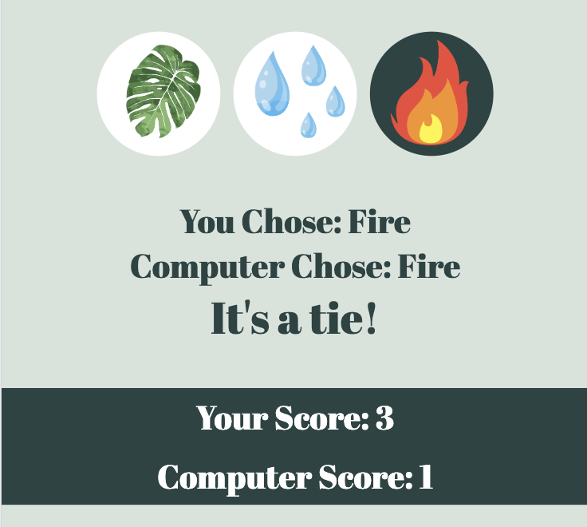

- To keep the game engaging and the player playing for longer, I added the feature of the winner is the first to get a score of 10. The player must try and win 10 rounds before the computer does. The following code was used to create this:

function checkWinner() {

    if (playerScore === 10) {
        resultDisplay.textContent = "You win the game!";
        resetGame();

    } else if (computerScore === 10) {
        resultDisplay.textContent = "Computer wins the game!";
        resetGame();
    }

- Once the player, or computer, reaches a score of 10, the game automatically resets, with the 'resetGame();' function. This means the player can go straight back into another game without having to click another button.

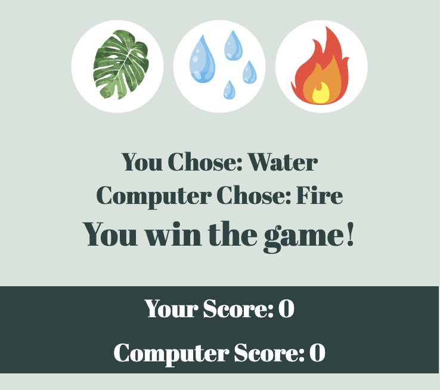

### Reset Button 
- For the player to restart the game at any point, instead of when they reach a score of 10, I added a restart button at the bottom of the page, which was visible to see and reset the game to start again.

- I used the following code:

function resetGame() {

    playerScore = 0;
    computerScore = 0;
    updatePlayerScore();
    updateComputerScore();
} 

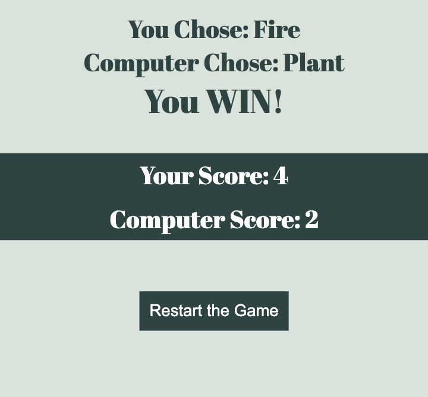

## Testing
## Browser Testing
I used ['Browser Stack'](https://live.browserstack.com/dashboard#os=android&os_version=13.0&device=Samsung+Galaxy+Z+Fold+5&device_browser=edge&zoom_to_fit=true&full_screen=true&url=https%3A%2F%2Fbrogandaisy.github.io%2FPlant-Water-Fire%2F&speed=1) to test a range of web browswers on desktop and mobile. See an example of tests below.
<table>
  <thead>
    <tr>
      <th>Browser</th>
      <th>Device</th>
      <th>Appearance</th>
      <th>Responsiveness</th>
    </tr>
  </thead>
  <tbody>
    <tr>
      <td>Chrome</td>
      <td>iPhone 15 and Desktop Surface 5</td>
      <td>All the pages format correctly. Game functionality and buttons work well.</td>
      <td>Responsive design / Very good</td>
    </tr>
    <tr>
       <td>Safari</td>
       <td>iPad 10 and Desktop Macook Pro</td>
      <td>All the pages format correctly. Game functionality and buttons work well.</td>
      <td>Responsive design / Very good</td>
    </tr>
    <tr>
      <td>Edge</td>
      <td>Galaxy Z Fold 5 and Desktop Macbook Air</td>
      <td>All the pages format correctly. Game functionality and buttons work work well.</td>
      <td>Responsive design / Very good</td>
    </tr>
 
  </tbody>
</table>

## Responsive Testing

<table>
  <thead>
    <tr>
      <th>Device</th>
      <th>Max-Width 575px Result (Small Mobile)</th>
      <th>Min-Width 576px Result (Large Mobile)</th>
      <th>Min-Width 768px Result (Tablet)</th>
      <th>Min-Width 992px and Larger Result (Desktop)</th>
     
    </tr>
  </thead>
  <tbody>
    <tr>
      <td>Galaxy Fold</td>
      <td>Game work, and display is correct. All images and buttons display.</td>
      <td>When rotated landscape, designed images are removed from 'Classes' page to save space and speed.</td>
      <td>N/A</td>
      <td>N/A</td>
    </tr>
    <tr>
       <td>iPhone 15 </td>
       <td>Game work, and display is correct. All images and buttons display.</td>
      <td>All game functions display and work when rotated.</td>
      <td>N/A</td>
      <td>N/A</td>
    </tr>
    <tr>
      <td>iPad Air</td>
      <td>N/A</td>
      <td>N/A</td>
      <td>Game functions work and buttons and icons displayed in full.</td>
        <td>N/A</td>
    </tr>
    <tr>
    <td>Macbook Air</td>
    <td>N/A</td>
    <td>N/A</td>
    <td>N/A</td>
    <td>Full display of the game, larger icons and game function works well.</td>
 
  </tbody>
</table>

## Device Formats
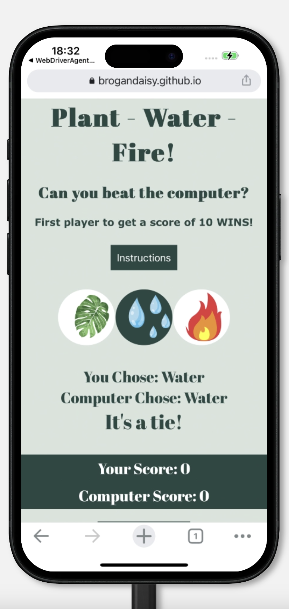
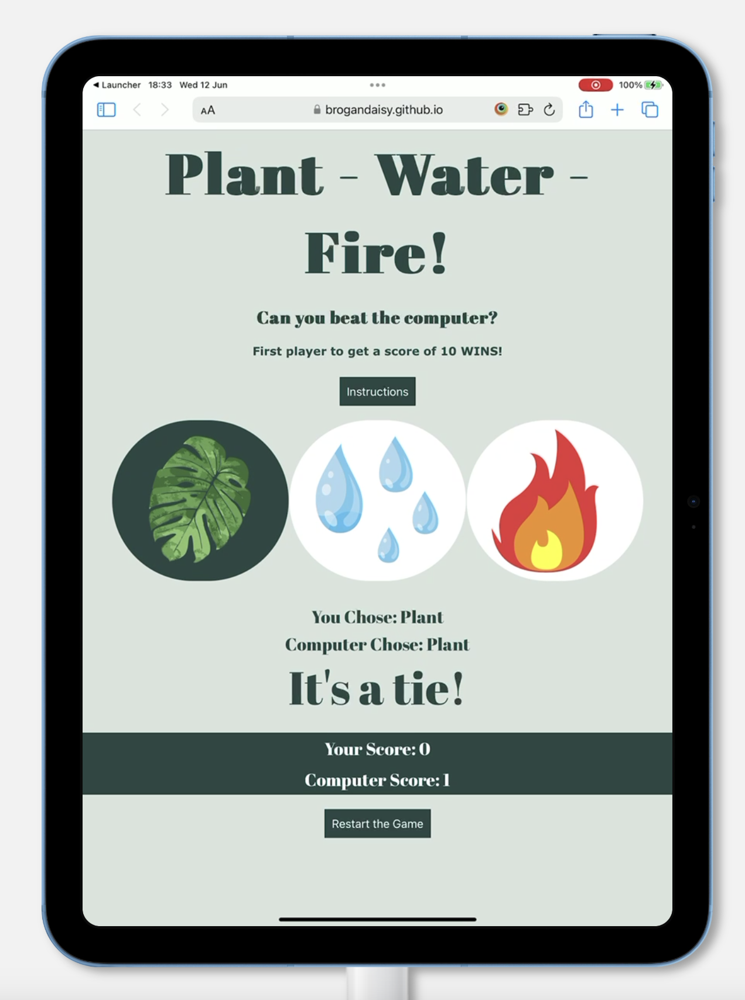
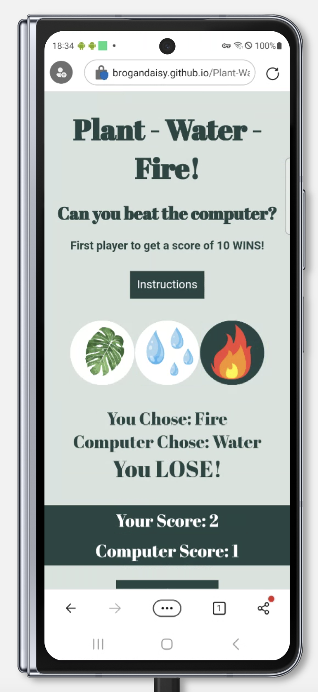

## Code Validation
### HTML Validation
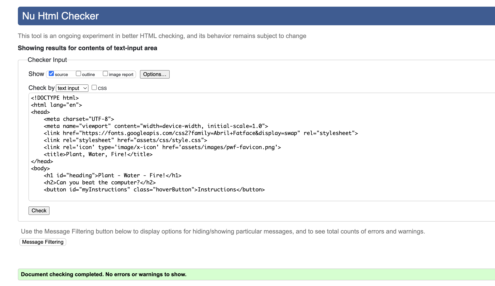
## CSS Validation
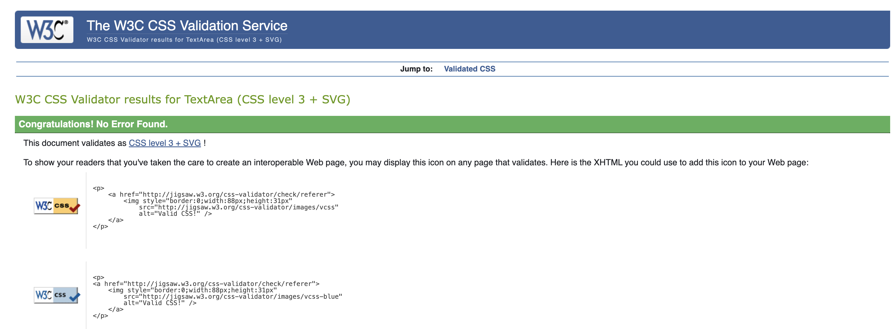
## Lighthouse Testing
### Lighthouse Test Mobile - Homepage
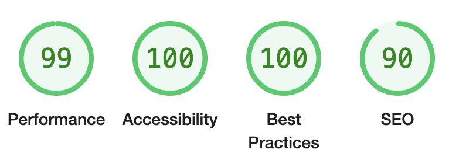

### Lighthouse Test Desktop - Homepage
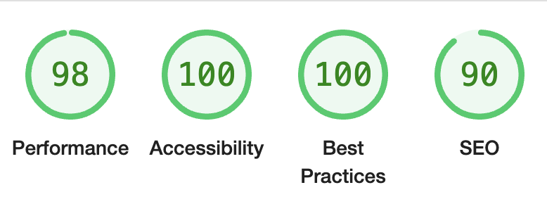

### Testing Errors and Improvements
When testing all the website pages using Lighthouse, I found the following bugs or improvements to increase the overall performance score:
- I ensured when choosing my brand colours that they would contrast well, to ensure a good accessability score.
- Slow loading times. I ensured my icon images were an appropriate size, to speed up loading.
- Removing any non-used code elements in CSS. This improved the best practice score.

## Technologies Used
### Languages
JavaScript, HTML and CSS languages.

### Technology
Github and Gitpod.

## Credits and Reference

Throughout the website build I used the following sources:

- Example code from Code Institute Love Running Project
- [W3Schools.com](https://www.w3schools.com/)
- [Unsplash.com](https://canva.com/) for all images
- [Canva](https://www.canva.com/) for favicon design

## Author
Brogan Carpenter

